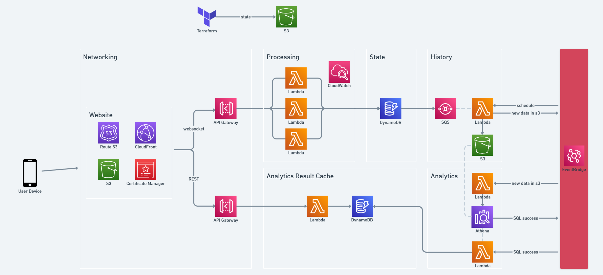

Written by Nick Sullivan.

# Death Dice

Each `game` has one or more `players`. Each player does a `roll`, which could warrant further `rolls`, until they finish their `turn`. Once all players finish their `turn`, results are calculated, and it all repeats.

Rules:

- Every player rolls two 6-sided dice.
- A players score is the sum of all their dice.
- The player with the highest score wins, everyone else takes a sip of their drink.
- If players roll `doubles`, two dice with the same value, they get to roll again.
- If players keep rolling the same value, they get to keep rolling, according to the following:
  - Two 1's: Your score is 0. Roll again - if it's 1, 2, or 3, finish your drink.
  - Four 2's: Hold one drink in each hand until your drink is finished. All drinking from one must be done to the other.
  - Three 3's: Stop playing, go have a shower (take your drink).
  - Four 4's: Put your head on the table until your drink is finished.
  - Five 5's: Buy something from Wish.com, and give it to Mr Eleven.
  - Six 6's: Stop playing, jump into the nearest body of water you can find.
- If a player has a final score of 11, they are known as Mr Eleven. They have always, and will always be known as Mr Eleven.
- If Mr Eleven rolls an 11, Mr Eleven wins. Any other players that rolled an 11 in that turn, don't lose.
- When a player wins 3 turns in a row, they get a 4-sided dice (the death dice).
- The player with the death dice must always win, otherwise they lose the death dice.
- If the player with the death dice wins two turns in a row, they upgrade their death dice (incrementing through the DnD dice set)
- If two players tie with an 8, they are affected by quantam cockring hands, pulling their wrist down as far as it goes until they finish their drink.

# Setting up

```
python3 -m venv .venv
./.venv/Scripts/activate
pip install pytest boto3 playwright pytest-playwright pytest-xdist snakeviz awswrangler mediatr opyoid
playwright install-deps
playwright install
```

```
cd lambda/game/libs
pip install -r requirements.txt --target python
```

```
cd terraform/environments/production
terraform init
terraform apply
```

# Developing locally

To test locally, I use VSCode with extensions `Playwright Test`, `Live Server`, `Terraform`, and `Python`.

## Python tests

pytest

## Browser tests

Run tests (see https://playwright.dev/python/docs/test-runners#cli-arguments for Playwright CLI)
(To use non-headless mode, uncomment "--headed" in settings.json)

Just unit tests

```
python -m pytest tests/unit_tests
```

All tests

```
pytest
pytest -n auto  // for parallel
pytest --headed // to see the browser
```

# Architecture



# Files

- `lambda` contains the contents of the Lambda functions, along with unit tests.
- `website` contains the website html, css, javascript and images
- `terraform` contains infrastructure as code
- `browser_tests` contains Playwright browser testing

# Profiling

Running in VSCode will dump a `profile.prof` file. View it with `snakeviz profile.prof`.

# TODO

- steal with single dice
- order gamestate by join datetime
- clean up logging
- some browser tests have delays
- flames for death dice
- mr eleven first to roll, not first in list
- Airhorn people that take too long
- 4 4 1 1 should be death dice
- death dice upgrade on 3 wins with two players

# TODO analytics

- consistent analytics gateway ID
- get, not post

# Stats

- extracting 161 records (2370ms, 67/128 MB)
- extracting 209 records (2507ms, 73/128 MB)
- extracting 193 records (2601ms, 73/128 MB)
- extracting 317 records (4596ms, 82/128 MB)

- transforming 0 messages (98ms, 240/512 MB, -)
- transforming 104 messages (1510ms, 240/512 MB, 12.7KB)
- transforming 975 messages (3964ms, 245/512 MB, 27.4KB)
- transforming 1322 messages (6256ms, 255/512 MB, 54.3KB)
